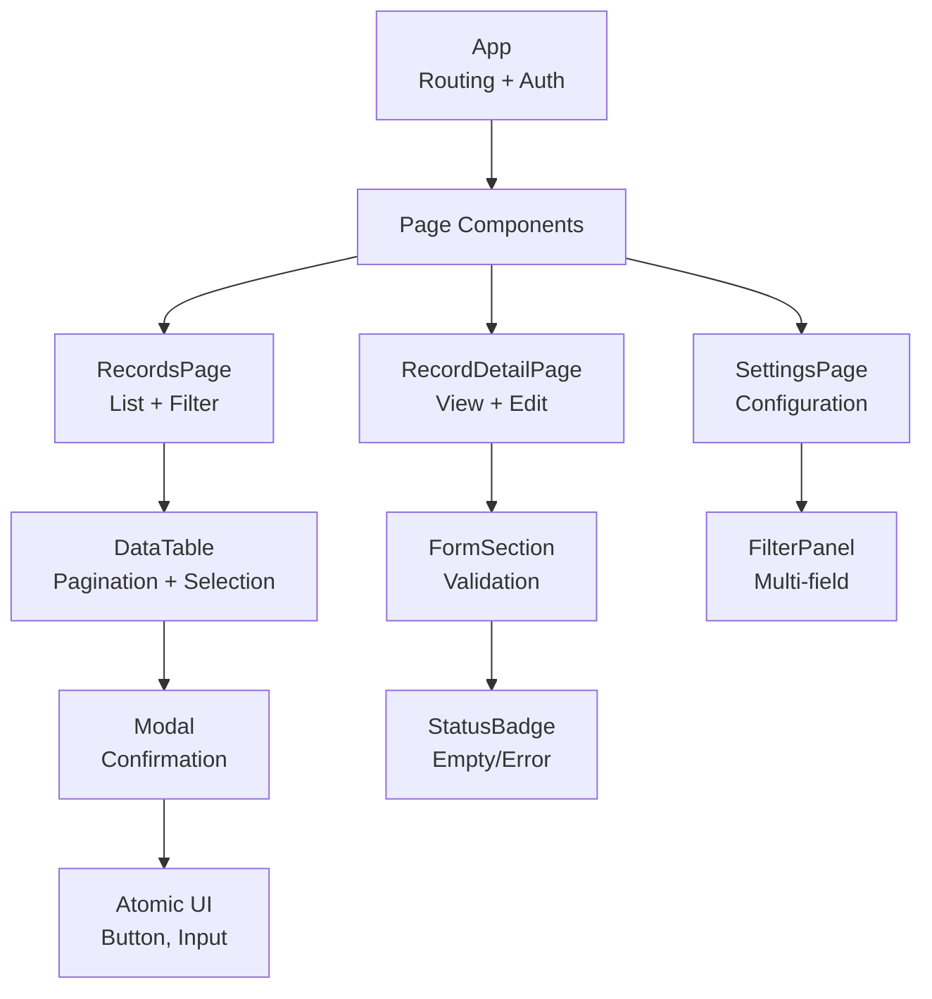

## Executive Overview
This React-based admin dashboard supports internal operational workflows. It is data-driven, form-heavy, </br>
and accessed by authenticated administrators and operational staff who prioritize </br>
speed, accuracy, and consistency.</br>

The frontend is designed to  predictable behavior, clear error handling, and maintainable components.

## Purpose of This Document
Admin dashboards evolve continuously with changing business rules. This documentation preserves </br>
architectural decisions, simplifies onboarding, and reduces defects.

## Scope
This document covers:
- Component boundaries and responsibilities
- State and data flow
- Form handling and validation
- API interaction patterns
- Onboarding guidance

It includes illustrative code snippets and diagrams, but excludes complete code, backend </br>
design, or deployment details.
 

## High-Level Architecture Overview
This section provides a conceptual overview of the frontend architecture, focusing on responsibility </br>
boundaries and data flow rather than implementation details.
### Layered Architecture

The frontend follows a layered architecture that separates concerns into three distinct layers:

- **Page orchestration layer**: Routes, layouts, and page-level state management  
- **UI and domain components**: Reusable tables, forms, modals, and view components  
- **Data layer**: API interactions, side effects, and data normalization  

This separation prevents business logic from leaking into UI components and keeps responsibilities explicit and easier to reason about.


### Responsibility Split

Responsibilities are clearly divided between the frontend and backend to reduce coupling and avoid duplicated logic.

**Frontend responsibilities include:**
- Rendering tabular and form-based views  
- Managing UI state such as filters, pagination, and form inputs  
- Handling loading, error, and empty states  
- Performing basic client-side input validation  

**Backend responsibilities include:**
- Authentication and authorization  
- Data validation and persistence  
- Business rule enforcement  
- Returning consistent and structured error responses  

This boundary ensures that the frontend remains focused on interaction and presentation, while the backend </br>
remains the single source of truth for business logic.

## Component Structure

Page-level components orchestrate data and compose reusable UI. This keeps coordination logic separate from presentation.

### Page-Level Components
Own view lifecycle and API coordination:

- Trigger API requests on user actions/route changes
- Manage page state (loading, error, filters, pagination)  
- Pass normalized data to children
- Avoid detailed UI logic

### Reusable Components
Handle specific UI/domain tasks via props:

- Data tables
- Filter panels  
- Form sections
- Modals/confirmation dialogs

**Stateless preferred**: Local state limited to UI concerns (focus, toggles).

### Business Logic Placement
- Data transformation: Near API boundary
- Validation: Centralized/reusable
- Side effects: Page/data layer only

### Benefits
- No oversized "god components"
- No duplicated page logic
- Clear change locations

## 5. State Management Strategy

State is divided into three categories to improve clarity, predictability, and debuggability across the dashboard.

---

### Remote State (API Data)

Remote state represents data retrieved from backend APIs and is owned at the **page level**. This includes:
- lists rendered in tables
- record details for view or edit flows
- dropdown or picklist options
- permission or role-based configuration

Page-level components control:
- when data is fetched (initial mount, filter changes, pagination)
- request parameters derived from UI state
- rendering of loading, error, and empty states

Centralizing remote state ownership at the page level ensures that data-fetching behavior remains visible and easy to reason about.

---

### UI State (Local Interactions)

UI state represents transient, interaction-driven state and is owned by the **lowest component that requires it**. When multiple components depend on the same UI state, coordination is handled at the page level.

Common examples include:
- filter values and pagination controls
- modal open/close state
- temporary form inputs prior to submission
- row or item selection for bulk actions

This approach prevents unnecessary state lifting while keeping shared interactions consistent.

---

### Derived State (Computed Values)

Derived state is calculated from existing state and is **never stored independently**. It is computed as close as possible to where it is consumed.

Examples include:
- empty-state checks (e.g., `rows.length === 0`)
- formatted display values (dates, labels, mappings)
- permission flags derived from roles or record status (e.g., `canEdit`)

Avoiding stored derived state reduces redundancy and prevents synchronization bugs.

---

### Unidirectional Data Flow

User interactions follow a predictable, unidirectional flow:

- User interaction updates UI state  
- UI state triggers an API request  
- The UI enters a loading state  
- The API response updates remote state  
- The UI re-renders based on the updated data or error state  

This flow minimizes hidden state mutations and simplifies reasoning about asynchronous behavior.

---

### Request Status Modeling

Each API interaction explicitly models request status rather than inferring it indirectly. Supported states include:
- `loading`
- `success`
- `empty` (successful response with no data)
- `error`

Treating these states explicitly ensures consistent behavior and clearer user feedback across all pages.

---

### Shared State Policy

Shared or global state is intentionally minimized. Only cross-cutting concerns—such as user session information or commonly reused picklists—are stored globally.  
In most cases, page-local state is preferred to reduce coupling and improve maintainability.

## 6. Form Handling & Validation Patterns

Forms are central to the dashboard’s core workflows, including record creation and updates, filtering, and configuration tasks. As these interactions often modify persistent data, form behavior prioritizes clarity, correctness, and predictable feedback.

---

### Form State Ownership

Form-related state is deliberately split to balance responsiveness with control:

- **Local state**:
Input values and immediate interaction state are managed within form components to keep them responsive and reusable.

- **Page-level state**:
Submission handling, request status, and success or failure outcomes are coordinated at the page level, where side effects and API interactions are managed.

This separation keeps form components focused on input concerns while centralizing submission logic.

---

### Client-Side Validation

Client-side validation is intentionally conservative and limited to obvious issues that can be detected immediately, such as:
- required field checks
- basic type or length constraints
- simple relational rules (for example, start date before end date)

The frontend does not attempt to replicate backend business rules, avoiding duplicated logic and potential drift.

---

### Server-Side Validation

The backend remains the authoritative source for business validation. Validation errors returned by the API are surfaced in the UI and mapped appropriately:

- **Field-level errors** when a specific input can be identified
- **Form-level errors** when validation applies to the submission as a whole

This ensures that complex or evolving rules remain centralized while still providing actionable feedback to users.

---

### Error Presentation and Feedback

Error and submission feedback follows consistent presentation rules:
- field-level errors are displayed inline, adjacent to the relevant inputs
- form-level errors are shown in a fixed, predictable banner location
- submission progress is indicated using a loading state with disabled submit actions

These conventions prevent ambiguous states and make form behavior predictable across the application.

---

### Failed and Partial Submissions

On failed submissions, user input is preserved to avoid unnecessary re-entry.
When partial success is supported by the backend, the UI clearly communicates what was saved and what still requires attention, using explicit messaging (for example, “X records saved, Y require correction”).

This behavior is especially important in operational workflows where data entry can be time-consuming.

---

### Benefits

This approach provides:
- no duplicated validation logic across frontend and backend
- clear localization of errors for faster correction
- predictable and consistent submission behavior
- reusable form patterns across multiple workflows
## 7. API Interaction Patterns

Most dashboard screens rely on backend APIs to list, view, create, and update records. To keep behavior consistent and debuggable, API interactions follow a standardized request lifecycle and error-handling approach.

---

### Request Lifecycle

API interactions are modeled as explicit state transitions rather than implicit side effects. Each request follows a predictable sequence:

1. Request parameters are derived from current UI state (filters, pagination, selected records).  
2. The API call is triggered.  
3. The affected UI region enters a loading state.  
4. The response is normalized and stored as remote state.  
5. Errors are surfaced predictably while preserving user context.  

This explicit lifecycle makes request behavior easier to trace and reason about during development and debugging.

---

### Scoped Loading Indicators

Loading states are scoped to the UI elements directly affected by the request:

- **Table views**: Table-level loading indicators or skeleton states  
- **Forms**: Disabled submit actions with visible submission indicators  
- **Dependent inputs**: Localized loading indicators for dropdowns or dynamic fields  

Where appropriate, failed requests can be safely retried without losing contextual state such as filters or partially entered form data.

---

### Response Normalization

API responses are normalized at the boundary between data access and UI rendering. This includes:
- mapping backend field names into frontend-friendly shapes  
- converting values into UI-ready types (for example, dates, booleans, enums)  
- handling missing or optional fields defensively  

Centralizing normalization reduces duplication and ensures consistent rendering across components.

---

### Error Visibility and Context Preservation

Errors are never handled silently. When requests fail:
- the failure is reflected visibly in the affected UI region  
- user context (filters, pagination, form input) is preserved  
- retry actions are supported where applicable  

This approach avoids disruptive resets and improves usability in operational workflows.

---

### Benefits

This interaction model provides:
- no invisible or implicit API requests  
- consistent behavior across pages and workflows  
- centralized data transformation and error handling  
- predictable recovery from transient failures  

## 8. Error Handling Strategies

API failures and network issues are treated as expected operating conditions rather than exceptional edge cases. Error handling is designed to preserve user context, provide clear recovery paths, and maintain consistent behavior across all dashboard pages.

---

### Error Categories

Errors are classified into a small set of predictable categories:

- **Network errors**: Timeouts, connectivity loss, or transient failures  
- **API errors**: Client or server responses (4xx / 5xx)  
- **Validation errors**: Backend-enforced business rule violations  
- **Permission errors**: Access denied or insufficient privileges  
- **Empty results**: Successful responses with no data  

Explicit categorization ensures that similar failures are handled consistently across workflows.

---

### Context Preservation

When errors occur, the UI preserves the user’s working context to avoid unnecessary re-entry or disruption. This includes:
- current filters and pagination state  
- selected rows or records  
- in-progress form input values  
- temporary UI state such as open modals or selections  

Preserving context is especially important in operational workflows where actions are repetitive or data entry is time-consuming.

---

### UI Presentation Rules

Error presentation follows clear and consistent rules based on scope and severity.

**Inline feedback**
- field-level validation errors are displayed directly below inputs  
- row-level permission issues are indicated using inline badges or status indicators  

**Page-level feedback**
- persistent banners are used for network or API failures  
- transient toasts are used for short-lived feedback or confirmations  
- empty states clearly communicate “no data” scenarios and provide relevant actions  

This separation avoids overwhelming users while keeping failures visible and actionable.

---

### Recovery Patterns

The system supports multiple recovery strategies depending on error type:

- **Retry**: Re-execute the request using the same parameters (network or retriable API errors)  
- **Reset**: Clear filters or local state and refetch default data  
- **Cancel**: Abort in-flight requests when context changes  
- **Undo**: Roll back optimistic updates when supported (used sparingly)  

Each recovery path is explicit and predictable.

---

### Defensive Rendering

The UI is resilient to incomplete or inconsistent data:
- missing fields fall back to safe defaults  
- partial responses render available data without breaking the layout  
- inconsistent API responses degrade gracefully rather than failing hard  

This defensive approach prevents UI crashes and improves system robustness.

---

### Developer Visibility

Error handling balances user experience with developer observability:

- **Users see** clear, actionable messages without internal details  
- **Developers receive** full error objects, codes, and diagnostic information for debugging  

This separation ensures usability without sacrificing maintainability.

---

### Benefits

This strategy provides:
- predictable failure behavior across pages  
- no data loss from transient errors  
- clear recovery paths for common failure scenarios  
- a debuggable and transparent request lifecycle  

## 9. Table & List Patterns

Tables and lists represent the majority of screens in the admin dashboard. These patterns standardize pagination, selection, bulk actions, and data presentation to ensure consistent behavior across workflows.

---

### Pagination Strategy

Pagination is controlled at the page level and driven by backend data.

Page-level state includes:
- current page (1-based indexing)
- page size (default: 25, configurable)
- total record count (from the API)
- derived page count based on total and page size

Pagination is **server-side**, with the backend responsible for offset/limit handling and filtered queries. This approach ensures scalability for large datasets.

---

### Row Selection Patterns

Row selection behavior is standardized across tables:

- **Single selection**: Explicit row actions or visual row highlighting  
- **Multi-selection**: Per-row checkboxes with a header-level “select all” option  
- **Select all behavior**: Header checkbox toggles all currently visible rows  
- **Persistent selection**: Selection state survives pagination and filtering changes  

This consistency prevents accidental actions and supports efficient bulk operations.

---

### Bulk Actions

Bulk actions are selection-driven and context-aware.

When rows are selected, a dedicated action toolbar becomes visible:
- **Primary actions**: Destructive operations such as delete (confirmation required)  
- **Secondary actions**: Export, archive, assign, duplicate  
- **Disabled states**: Actions display clear reasons when unavailable (for example, insufficient permissions or mixed selection types)  

This approach avoids hidden actions and makes intent explicit.

---

### Sorting and Filtering

Sorting and filtering follow predictable rules:

- column headers support single-column sorting only  
- multiple filters are grouped within a collapsible filter panel above the table  
- filter state persists across pagination and navigation  
- a single “clear all” action resets all filters  

These patterns balance flexibility with simplicity and reduce accidental state resets.

---

### Empty and Loading States

Table states are explicitly differentiated:

- **Initial load**: Skeleton rows matching table height  
- **No data**: “No records match your filters” with a relevant action  
- **Filtered empty**: Guidance to adjust filters  
- **Error state**: Error banner with retry option  

Clear state differentiation prevents ambiguity and improves user confidence.

---

### Performance Considerations

Performance optimizations are applied selectively based on data size and usage patterns:
- virtualization for large tables (typically >100 rows)  
- debounced search inputs (approximately 300ms delay)  
- memoized row rendering using stable record identifiers  
- optional column resizing with persisted widths stored locally  

These optimizations prioritize usability without introducing unnecessary complexity.

---

### Benefits

These patterns provide:
- consistent table behavior across all pages  
- predictable selection and bulk action workflows  
- scalability through server-side pagination  
- clear guidance during empty, loading, and error states  

## 10. Onboarding Guide for New Developers

This section provides a structured onboarding path for frontend developers joining the admin dashboard codebase. The objective is to enable new contributors to become productive quickly while minimizing the risk of unintended architectural or behavioral changes.

Rather than a file-by-file walkthrough, this guide focuses on mental models, recurring patterns, and safe entry points into the system.

---

### Quickstart (Day 1)

New developers should begin with a focused exploration of the application:

1. Set up and run the application locally.
2. Authenticate using the provided demo credentials.
3. Navigate to a records-based page and experiment with filtering and pagination.
4. Open the corresponding page-level component and trace the flow from UI state to API request to rendered output.
5. Observe request lifecycles and state transitions using browser developer tools and structured logs.

A recommended first task is fixing a small, non-critical table filter issue. Completing this task typically indicates a solid understanding of the dashboard’s core interaction patterns.

---

### Codebase Overview

The frontend codebase is organized around clear responsibility boundaries:

```text
src/
├── pages/           # Page orchestration (state ownership and API coordination)
├── components/      # Reusable UI elements (tables, forms, modals)
├── hooks/           # Shared logic (data fetching, validation)
├── services/        # API clients and response normalization
└── utils/           # Shared helpers (formatting, validation)
```
 

Developers are encouraged to begin by reviewing the following files:

- **`pages/RecordsPage.tsx`** — a representative example of a complete page  
- **`hooks/useApiData.ts`** — shared API interaction and request state handling  
- **`components/DataTable.tsx`** — the core table abstraction used across screens  

These files illustrate the core patterns used throughout the dashboard.

---

## Core Architectural Patterns

The dashboard follows a small set of repeatable patterns that appear consistently across pages:

- **State ownership hierarchy:**  
  Page → Component → Derived state

- **API interaction lifecycle:**  
  Build → Load → Normalize → Render

- **Explicit error handling:**  
  Status tracking, context preservation, and defined recovery paths

- **Tables:**  
  Server-side pagination with persistent row selection

- **Forms:**  
  Local input state with page-level submission and side effects

Understanding these patterns is more important than memorizing individual files.

---

## Debugging Workflow

When issues arise, follow this consistent debugging approach:

1. Inspect the **page-level component**, which owns data flow and request coordination.
2. Review **hook return values** to confirm request state and normalized data shape.
3. Verify **request parameters** in the network tab match the current UI state.
4. Inspect **structured console logs** for state transitions and errors.
5. Check **error boundaries or overlays** for render-time failures.

In most cases, inspecting page-level state resolves the majority of issues efficiently.

---

## Common Development Tasks

Typical development tasks map directly to established patterns:

- **Add a new page:**  
  Create a page-level component and register the route.

- **Add a table column:**  
  Update table configuration and API query parameters.

- **Add a filter:**  
  Extend the filter panel and page-level state.

- **Add a form field:**  
  Manage local input state and pass values during submission.

- **Add a bulk action:**  
  Reuse selection state and invoke the relevant API service.

Following these mappings reduces duplication and review overhead.

---

## Contribution Guidelines

To maintain consistency and code quality:

- Use feature branches with descriptive names
- Run linting and tests before submitting changes
- Update this document when introducing new patterns
- Ensure pull requests align with established conventions
- Record user-facing changes in the changelog

---

## Onboarding Milestones

Typical onboarding progress follows this trajectory:

- **Day 1:** Navigate pages and use filters independently  
- **Day 3:** Add new table columns and filters  
- **Week 1:** Build a complete new page using existing patterns  
- **Week 2:** Identify and improve a performance bottleneck  

---

## Benefits

This onboarding approach results in:

- Consistent understanding of system patterns within hours rather than weeks
- A shared mental model across all pages
- A clear and repeatable debugging path from day one
- Documentation that evolves alongside the codebase

## 11. Appendix: Reference Materials
Complete reference section with diagrams, templates, and definitions for the admin dashboard architecture.


## Data flow (Happy path scenario)


 


 


 


